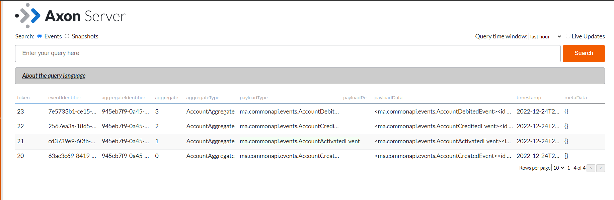

# gestion-des-comptes-avec-les-Framework-AXON-et-Spring-Boot
une application qui permet de gérer des comptes respectant les patterns CQRS et Event Sourcing avec les Framework AXON et Spring Boot 

### 1. Lancer OXON Server 

- 'http://localhost:8024/'

### 2. Lancer CompteCommandSideApplication :

 -  pour ajouter un Compte :

    

 - pour faire un opération credit :

    

 - pour faire un operation debit :

    

 - vous pouvez voir les evinements d'un compte :

    

    

### 3. Lancer CompteQuerySideApplication :
 
 - vous pouvez voir les evinements:

    

 - pour voir les comptes : 

    

 - pour voir un compte : 

    

## OXON :

